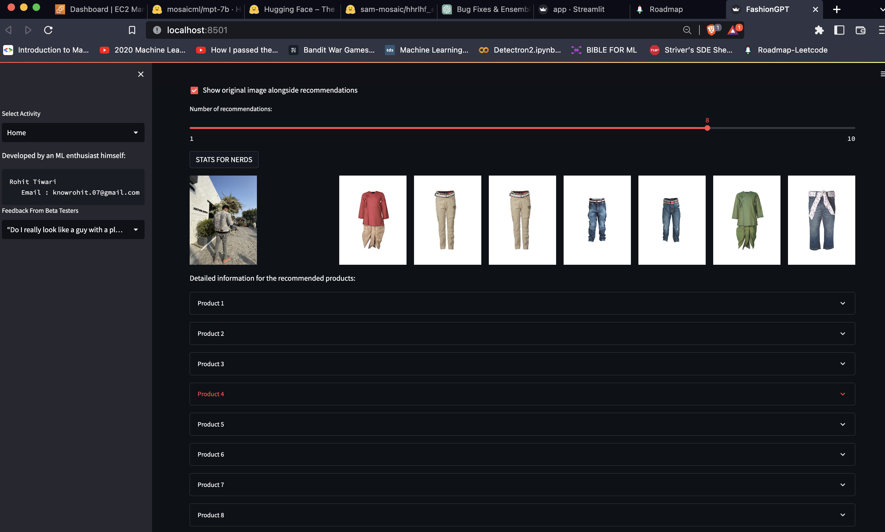
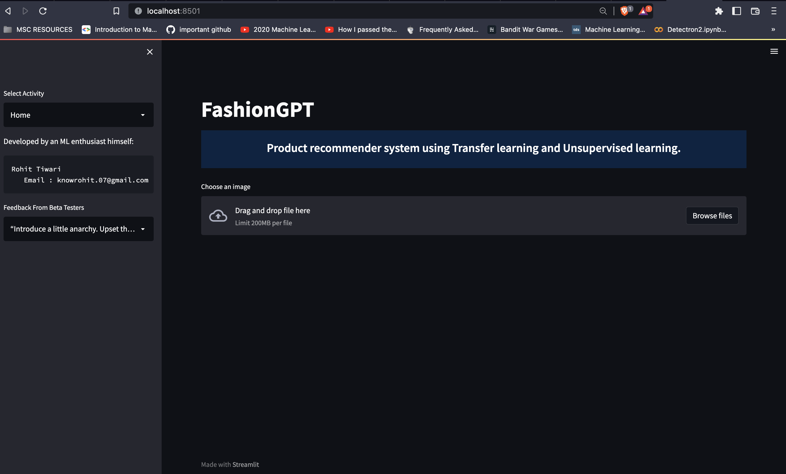
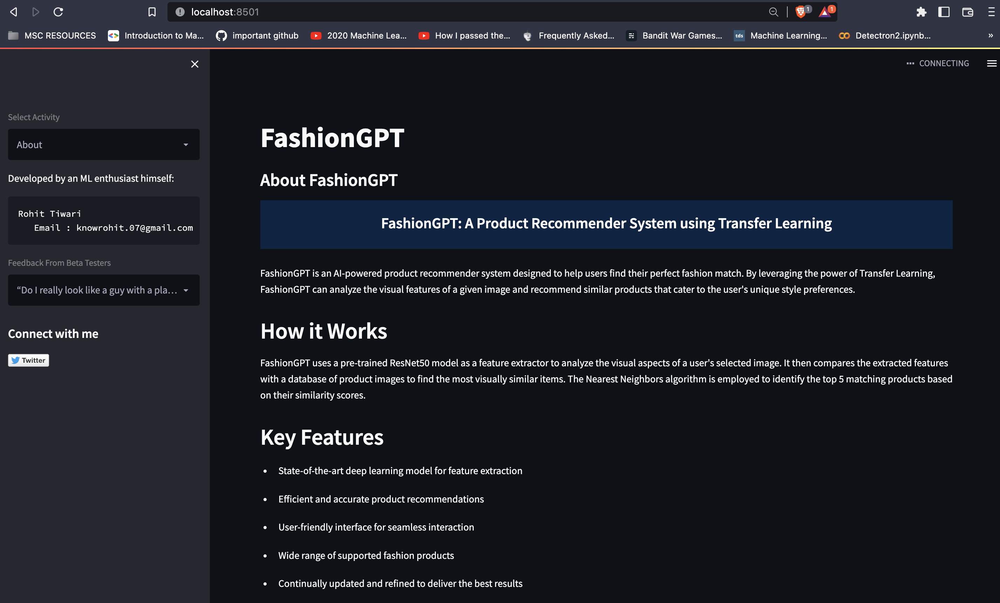
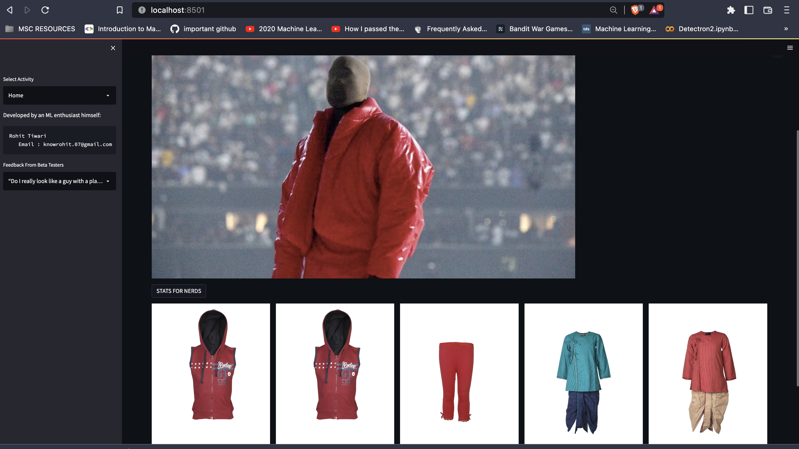
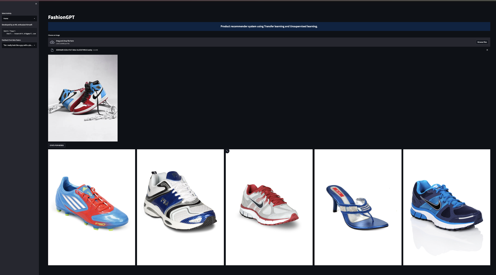
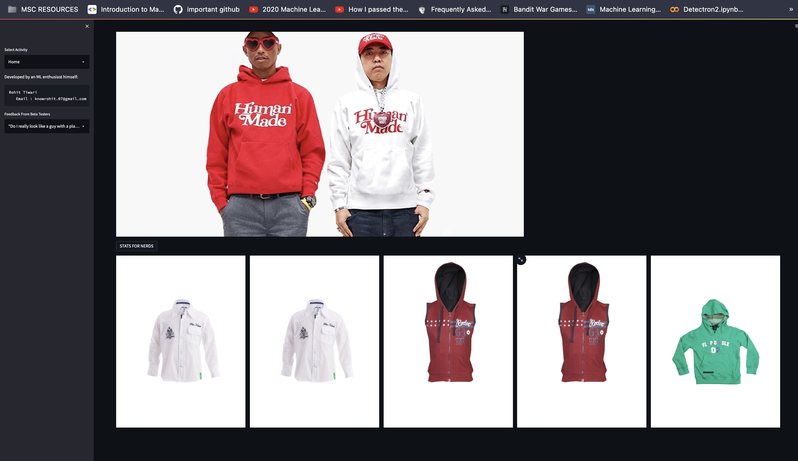
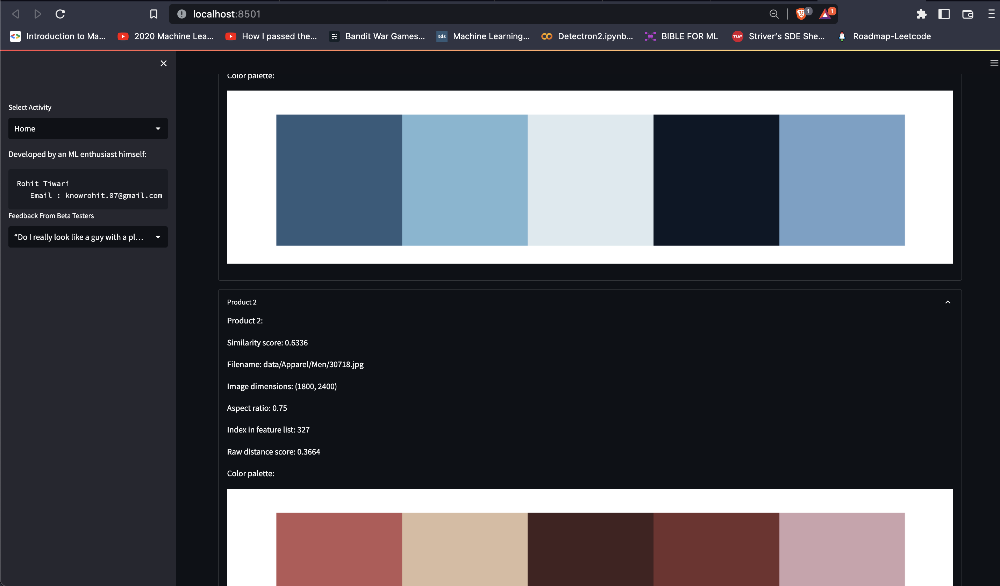

# FashionGPT: AI 기반 패션 추천 시스템 & VirgilAblohGPT: 하입비스트 챗봇 어시스턴트 🥷🏻🥶

안녕하세요! 이 프로젝트는 두 가지 강력한 구성 요소를 결합합니다: FashionGPT, AI 기반 패션 추천 시스템, 그리고 VirgilAblohGPT, ChatGLM-6b로 구동되는 패션 챗봇 어시스턴트. 이 둘은 종합적인 패션 경험을 제공하며, 여러분의 가이드와 하입비스트 친구 역할을 합니다.

 

## 작동 원리

FashionGPT는 사전 훈련된 ResNet50 모델을 특징 추출기로 사용하여 사용자가 선택한 이미지의 시각적 측면을 분석합니다. 그런 다음 추출된 특징을 제품 이미지 데이터베이스와 비교하여 가장 시각적으로 유사한 항목을 찾습니다. Nearest Neighbors 알고리즘을 사용하여 유사성 점수를 기반으로 상위 매칭 제품을 식별합니다. 사용자는 원본 이미지를 추천 항목과 함께 표시할 수 있으며, 추천 항목의 수를 조정할 수 있습니다. 추가 제품 정보와 색상 팔레트도 각 추천 항목에 대해 제공됩니다.

VirgilAblohGPT (https://github.com/knowrohit/virgilablohGPT)는 패션 관련 대화와 추천을 제공하여 경험을 향상시킵니다. ChatGLM-6b로 구동되는 이 챗봇은 패션 주제에 대한 정보를 제공하고, 토론에 참여하며, 다양한 패션 관련 작업을 지원합니다. 사용자는 여름 패션, 겨울 트렌드, 빈티지 스타일, 스트리트 스타일, 운동 기어, 액세서리, 지속 가능한 패션, 최신 패션 기술, 패션 인플루언서, 개인 스타일링 팁, 드레스 코드와 같은 다양한 주제 중에서 선택할 수 있습니다. 또한 코딩, 요약, 감정 탐지, 우정, 교육, 유머, 스토리텔링, 번역, 글쓰기, 사실 확인, 조언, 예측, 분석, 브레인스토밍, 협상, 동기 부여와 같은 특정 작업을 선택할 수 있으며, 각 작업은 고유한 응답을 제공합니다.

## 메인 화면
 

# 주요 기능

## FashionGPT
- 최첨단 딥러닝 모델을 사용한 특징 추출
- 효율적이고 정확한 제품 추천
- 사용하기 쉬운 인터페이스
- 원본 이미지를 추천 항목과 함께 표시하는 옵션
- 추천 항목 수 조정 가능
- 추천 제품에 대한 상세 정보와 색상 팔레트 제공
- 다양한 패션 제품 지원
- 최고의 결과를 제공하기 위해 지속적으로 업데이트 및 개선

## VirgilAblohGPT:
- ChatGLM-6b로 구동되는 패션 챗봇 어시스턴트
- 패션 관련 대화에 참여하고 정보를 제공
- 집중적인 토론을 위한 다양한 패션 주제 지원
- 맞춤형 응답을 위한 특정 패션 작업 제공
- 추천, 조언 및 지원 제공
- 대화 기록을 쉽게 검토할 수 있도록 추적

## 제품 추천

## 개발자

FashionGPT는 AI 열정가이자 패션 애호가에 의해 개발되었습니다. 그는 사용자가 이상적인 패션 제품을 쉽게 찾을 수 있도록 기술의 힘을 활용하여 쇼핑 경험을 개선하는 혁신적인 솔루션을 제공하는 데 전념하고 있습니다.

## 통계

## 문의하기

저희는 여러분의 의견을 듣고 싶습니다! 질문, 제안 또는 피드백이 있으시면 knowrohit.work@gmail.com으로 연락해 주세요. 또한 [Twitter](https://twitter.com/knowrohit07)에서 저희와 연결할 수 있습니다.

## 감사의 말

FashionGPT 개발에 귀중한 지원과 기여를 해주신 다음 자원과 조직에 감사의 말씀을 전합니다:

- [Rahul Tiwari](https://twitter.com/rahul_tiwari95)에게 영감을 주셔서 감사합니다.드 구조 개선 제안
- [원작자의 GitHub](https://github.com/knowrohit/Fashion-Rec-Sys)
# clothsAI
